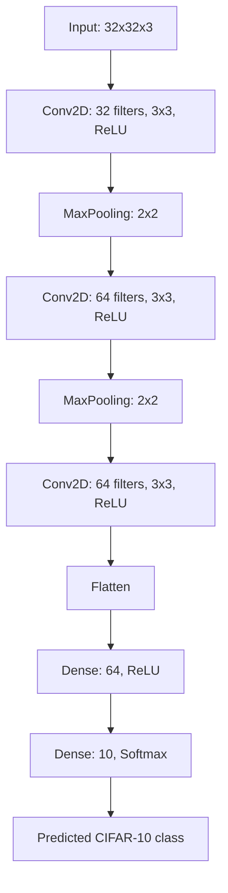

# Architecture

## CNN

## Layer Roles

- `Input`: receives 32×32 RGB images.
- `Conv2D`: extracts spatial features.
- `MaxPooling2D`: reduces spatial dimensions.
- `Flatten`: converts feature maps into a vector.
- `Dense(64)`: learns a classification representation.
- `Dense(10)`: outputs probabilities for the ten classes.

The layer sequence and parameters are taken from the supplied guide.
