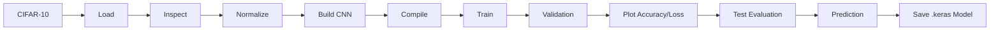

# Project Flow

## Full Pipeline

1. Load CIFAR-10.
2. Check the shapes.
3. Inspect sample images.
4. Normalize pixel values.
5. Build the CNN.
6. Compile with Adam and sparse categorical crossentropy.
7. Train for 10 epochs with batch size 64.
8. Use 20% of the training set for validation.
9. Plot accuracy and loss.
10. Evaluate on the test set.
11. Predict a selected image.
12. Save the trained model.
