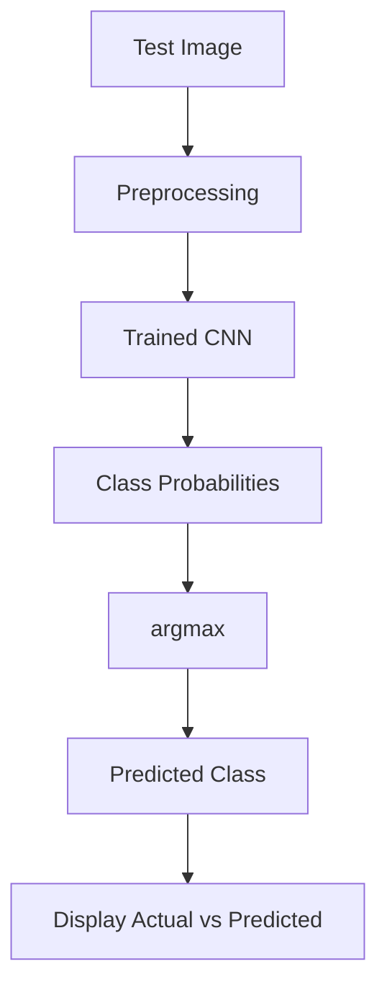

# CIFAR-10 CNN Image Classification

> **A TensorFlow/Keras Convolutional Neural Network (CNN) for classifying CIFAR-10 images into 10 object categories.**

## Professional Project Title

**CIFAR-10 Image Classification using Convolutional Neural Networks**

## Short Description

**A deep learning image-classification project built with TensorFlow and Keras that preprocesses CIFAR-10 images, trains a CNN, evaluates performance, visualizes learning curves, and predicts image classes.**

## Project Overview

This project follows a complete beginner-friendly Deep Learning pipeline from the supplied step-by-step guide:

```text
CIFAR-10 Dataset
      ↓
Data Inspection
      ↓
Image Normalization
      ↓
CNN Feature Extraction
      ↓
Classification
      ↓
Training + Validation
      ↓
Test Evaluation
      ↓
Prediction
      ↓
Saved Model
```

The project uses the CIFAR-10 dataset, which contains 50,000 training images and 10,000 test images. Each image is `32 × 32 × 3` (RGB), and the task is to classify each image into one of 10 classes.

## 10 Classes

```text
0  airplane
1  automobile
2  bird
3  cat
4  deer
5  dog
6  frog
7  horse
8  ship
9  truck
```

## System Architecture

```mermaid
flowchart LR
    A[CIFAR-10 Dataset] --> B[Load Data]
    B --> C[Inspect Images]
    C --> D[Normalize 0-255 to 0-1]
    D --> E[Input 32x32x3]
    E --> F[Conv2D 32 + ReLU]
    F --> G[MaxPooling 2x2]
    G --> H[Conv2D 64 + ReLU]
    H --> I[MaxPooling 2x2]
    I --> J[Conv2D 64 + ReLU]
    J --> K[Flatten]
    K --> L[Dense 64 + ReLU]
    L --> M[Dense 10 + Softmax]
    M --> N[Class Prediction]
```



## CNN Architecture

The model follows the architecture specified in the supplied guide:

```text
Input
32 × 32 × 3
     │
     ▼
Conv2D
32 filters
3 × 3 kernel
ReLU
     │
     ▼
MaxPooling
2 × 2
     │
     ▼
Conv2D
64 filters
3 × 3 kernel
ReLU
     │
     ▼
MaxPooling
2 × 2
     │
     ▼
Conv2D
64 filters
3 × 3 kernel
ReLU
     │
     ▼
Flatten
     │
     ▼
Dense
64 neurons
ReLU
     │
     ▼
Dense
10 neurons
Softmax
     │
     ▼
10-class prediction
```

### What each part does

**Conv2D:** learns spatial patterns such as edges, corners, lines, and textures. Deeper layers can learn more complex structures.

**3×3 kernel:** a small moving window that examines local regions of the image.

**ReLU:** introduces non-linearity.

**MaxPooling2D:** reduces spatial dimensions while preserving strong features.

**Flatten:** converts the feature maps into a one-dimensional representation.

**Dense(64):** learns from the extracted features.

**Dense(10) + Softmax:** produces probabilities for the 10 CIFAR-10 classes.

## Dataset Shape

The supplied guide specifies approximately:

```text
Training images: (50000, 32, 32, 3)
Training labels: (50000, 1)

Test images:     (10000, 32, 32, 3)
Test labels:     (10000, 1)
```

Interpretation:

```text
50000 = number of images
32    = image height
32    = image width
3     = RGB channels
```

## Preprocessing

Original pixel values:

```text
0 ─────────────── 255
```

The project normalizes them to:

```text
0 ─────────────── 1
```

using:

```python
train_images = train_images.astype("float32") / 255.0
test_images = test_images.astype("float32") / 255.0
```

This scales the input values to a suitable numerical range for training.

## Training Configuration

The guide specifies:

```python
optimizer="adam"
loss="sparse_categorical_crossentropy"
metrics=["accuracy"]
```

Training:

```python
epochs=10
batch_size=64
validation_split=0.2
```

With `validation_split=0.2`, approximately:

```text
50,000 original training images
        │
        ├── 40,000 → training
        └── 10,000 → validation
```

The independent 10,000-image test set remains for final evaluation.

## Training vs Validation vs Test

| Dataset | Purpose |
|---|---|
| Training | Model learns its weights |
| Validation | Used during development to monitor/tune the model |
| Test | Final independent evaluation |

This distinction is important in machine learning.

## Learning Curves

The project plots:

- Training Accuracy
- Validation Accuracy
- Training Loss
- Validation Loss

Example interpretation:

```text
Training accuracy ↑
Validation accuracy ↓
        ↓
Possible overfitting
```

The supplied guide specifically introduces overfitting through the relationship between training and validation performance.

## Prediction Flow



## Save and Reload the Model

The guide saves the trained model as:

```text
cifar10_cnn.keras
```

Later it can be loaded for inference:

```python
model = tf.keras.models.load_model("cifar10_cnn.keras")
```

This creates the foundation for a future application architecture:

```text
Train Model
    ↓
Save Model
    ↓
Backend Loads Model
    ↓
New Image
    ↓
Inference
    ↓
Prediction / Dashboard
```

## Project Structure

```text
CIFAR10-CNN-Image-Classification/
│
├── README.md
├── requirements.txt
├── LICENSE
├── .gitignore
├── CONTRIBUTING.md
│
├── src/
│   ├── __init__.py
│   └── cifar10_cnn.py
│
├── notebooks/
│   └── cifar10_cnn_complete.ipynb
│
├── tests/
│   └── test_cifar10_cnn.py
│
├── docs/
│   ├── ARCHITECTURE.md
│   ├── CONCEPTS.md
│   └── PROJECT_FLOW.md
│
├── data/
│   └── README.md
│
├── models/
│   └── README.md
│
└── outputs/
    └── README.md
```

## Installation

Create a virtual environment:

### Windows

```bash
python -m venv .venv
.venv\Scripts\activate
```

### Linux/macOS

```bash
python3 -m venv .venv
source .venv/bin/activate
```

Install dependencies:

```bash
pip install -r requirements.txt
```

## Run the Project

```bash
python -m src.cifar10_cnn
```

The script will:

1. Load CIFAR-10.
2. Print dataset shapes.
3. Display sample images.
4. Normalize image values.
5. Build the CNN.
6. Compile the model.
7. Train for 10 epochs with batch size 64.
8. Plot accuracy and loss.
9. Evaluate on the test set.
10. Predict a selected test image.
11. Save the model to `models/cifar10_cnn.keras`.

> Training time and final accuracy depend on the local hardware and software environment. This repository does not claim a specific final accuracy unless it has been actually measured in a run.

## Notebook

The notebook in `notebooks/cifar10_cnn_complete.ipynb` follows the same sequence as the guide and is intended for step-by-step learning in Jupyter or Google Colab.

## Testing

Run:

```bash
pytest -q
```

The tests focus on deterministic helper behavior and model architecture configuration without requiring a full training run.

## Future Remote-Sensing Connection

The supplied guide notes that the CIFAR-10 workflow is useful preparation for remote sensing. A future image pipeline could move from:

```text
32 × 32 × 3
```

to examples such as:

```text
64 × 64 × 13
```

for multispectral Sentinel-2-style data.

The core concepts remain:

```text
Image
 ↓
Preprocessing
 ↓
CNN
 ↓
Feature Extraction
 ↓
Classification
 ↓
Prediction
```

## Future Improvements

- Add data augmentation.
- Add callbacks such as early stopping.
- Add a confusion matrix.
- Add per-class evaluation.
- Compare training and validation behavior more deeply.
- Build a web dashboard for inference.
- Add an image-upload interface.
- Package the trained model for deployment.
- Adapt the pipeline to a remote-sensing dataset.

These are future extensions; they are not part of the supplied guide's core implementation.

## Resume / CV Description

**CIFAR-10 Image Classification using CNN — TensorFlow, Keras, NumPy, Matplotlib**

> Developed a Convolutional Neural Network using TensorFlow/Keras for 10-class CIFAR-10 image classification. Implemented image inspection, pixel normalization, multi-layer convolutional feature extraction, max pooling, dense classification, validation monitoring, test evaluation, prediction visualization, and model saving.

## LinkedIn Project Description

Built a **CIFAR-10 Image Classification** project using **TensorFlow and Keras** to understand the complete Deep Learning workflow.

**Implemented:**
- CIFAR-10 dataset loading
- Image visualization
- Pixel normalization
- Conv2D + ReLU layers
- MaxPooling
- Flatten + Dense layers
- Softmax classification
- Adam optimizer
- Training/validation monitoring
- Accuracy and loss graphs
- Test evaluation
- Image prediction
- Saved `.keras` model

## Reference Material

The project was structured from the supplied step-by-step guide, which points to the TensorFlow CNN tutorial and the CIFAR-10 dataset documentation.

## License

MIT License.
